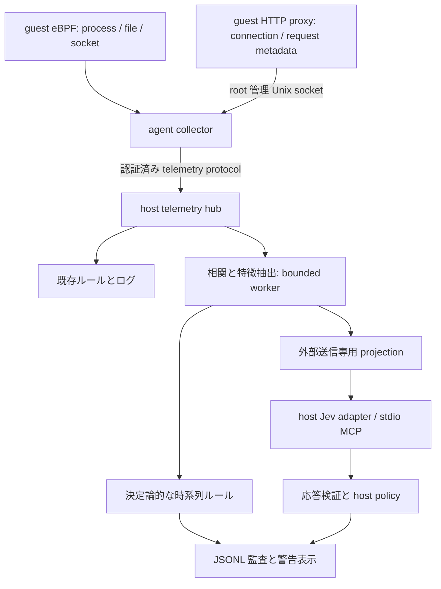

# Izanagi × Jev 行動分析設計

状態: PoC 実装・検証。2026-10-09。
設計時の baseline: Izanagi `eb14149b5b508c1814ee84a7358d855d63b1dbec`。
実装: [PR #47](https://github.com/ieee0824/izanagi/pull/47)。測定した core source は `3ab9d3fd358e979ae222cfb942399b6c543128af`。
Jev 接続実装の参考: jev-mcp `4461942c6a07e4814b7591b6b2dde90a12f7e8dc`。
本設計の issue 一覧は末尾に記載する。実 API と VM の検証結果・制約は [検証記録](jev-behavior-validation.md) に記載する。

## 目的と最初の到達点

パッケージインストールに伴うファイルアクセスと通信を関連付け、既存ルールを補完する監査用の分類を追加する。
最初の PoC は **QEMU / Linux eBPF / guest 内 HTTP/1.1 明示プロキシ**に限定し、ダミー資格情報へのアクセス試行の後に、関連するプロセスから外部 POST が生じる系列を扱う。
HTTP 本文とファイル内容を観測しないため、警告名は「アクセス試行と POST の不審な関連」とし、実際の情報持ち出しを断定しない。

既存の DNS/HTTP ポリシーと syscall ルールが行う判断を優先する。Jev は補助的な監査・警告にのみ使用する。
Jev の停止は分類を degraded にするが、既存の監視接続の失敗が sandbox を停止する動作は維持する。

第一段階に含めないもの: 自動遮断、攻撃の確定、HTTP 本文解析、TLS 復号の追加、QUIC 解析、任意 PCAP の入力、全 backend 対応、Jev の学習・fine-tuning。
DNS トンネリング、ビーコニング、ダウンロード後の実行、確認済みファイル読取の系列は第二段階の候補とする。

## 設計開始時の実装との差分

| 現状の事実 | 設計上の対応 |
| --- | --- |
| SyscallEvent に PID/TGID はあるが、session/event ID、親プロセス、起動世代がない | 共通 envelope と ProcessKey を追加 |
| eBPF の既存イベントは entry 時点であり、変換時の Ok(0) は実戻り値ではない | attempt と完了を区別し、必要な exit 観測を追加。旧データを成功扱いしない |
| raw の FD・socket 情報が host イベントへ渡らない | 接続照合に必要な FD/tuple/接続世代と成否を取得 |
| HTTP 記録は src_addr、method、path 等で、PID と接続 ID がない | guest で受けた接続を kernel 観測に結び付ける |
| 現 HTTP capture の平文モードは記録後 403、HTTPS モードは直接 TLS terminate | 新しい明示 HTTP forward モードを別に追加。配置変更だけで使えると想定しない |
| DNS は許可成功を含む統一イベントを提供しない | 第二段階で structured DNS emitter を追加 |
| ProxyManager はホストで子プロセスを起動し、QEMU は SLIRP/NAT を使う | PoC は guest sidecar。NAT 前後の tuple を時間だけで照合しない |
| 現在の PCAP は LINKTYPE_USER0 の host-agent 診断通信 | 外部通信キャプチャとして利用しない |
| Engine の保存 callback は個別 spawn_blocking | 保存順を発生順とせず、独立の順序情報と相関 worker を使う |
| Alert は単一 syscall、保存ログは表示用テキスト | 新しい BehaviorAssessment と JSONL を併設 |

実装根拠: [event.rs](https://github.com/ieee0824/izanagi/blob/eb14149b5b508c1814ee84a7358d855d63b1dbec/src/event.rs)、[ebpf_tracer.rs](https://github.com/ieee0824/izanagi/blob/eb14149b5b508c1814ee84a7358d855d63b1dbec/src/ebpf_tracer.rs)、[HTTP capture](https://github.com/ieee0824/izanagi/blob/eb14149b5b508c1814ee84a7358d855d63b1dbec/izanagi-http-capture/src/http_capture.rs)、[PCAP](https://github.com/ieee0824/izanagi/blob/eb14149b5b508c1814ee84a7358d855d63b1dbec/src/pcap_writer.rs)。

## データ経路

現 Detector の同期 Rule::check 内では推論しない。telemetry hub は既存イベント経路に負荷を押し返さず、分類用 worker へ bounded queue で複製する。
新しい共有 telemetry 型は std/serde の専用 crate に置き、host・agent・proxy で共有する。izanagi-common の no_std raw ABI と切り離す。

guest sidecar は agent が tracing session と一緒に管理する。Unix socket は root 管理・peer UID 検証とし、アプリから session/PID/event ID を申告させない。
sidecar の source identity は agent が付与する。アプリの任意ヘッダーを相関証拠にしない。偽メタデータを直接投入できる権限は与えない。
共通 message の追加と raw ABI 変更は明示的な protocol version 更新（v3）と host-agent 同時更新で扱い、旧 v2 を暗黙に解釈しない。capability は観測可否の表示に使い、version mismatch は明確に拒否する。
wire version と eBPF raw ABI は別に検査する。agent は object の ABI version/サイズ/必要 map・probe を検証し、旧 object との不一致を TraceStarted 前に拒否する。

## 共通イベントと観測の意味

TelemetryEnvelope の必須項目:

- schema_version、session_id、guest_boot_id、source_instance_id、source_seq、event_id。
- event_id は session/source/seq から一意化し、collector 再起動時に source_instance_id を変える。
- observed_monotonic_ns、clock_domain、host_received_at。wall clock は表示用。変換誤差と時計同期状態を別に保持する。
- ProcessKey = session + guest boot + PID namespace + TGID + process start identity。TID は別項目。exec は同じプロセス起動世代の exec generation として記録する。
- typed payload と coverage。取得できない値は null/Unknown と理由を付け、0 や false で代用しない。

最初の payload は ProcessStart/Fork/Exec/Exit、FileAccessAttempt、FileOpenOutcome、SocketConnect/SocketLifecycle、HttpRequest/HttpOutcome、ObservationGap、CollectorHealth、RuleMatch とする。
FileReadCompleted は後段拡張。ファイルを open しただけで「読んだ」としない。既存 entry-only イベントの result は Unknown として変換する。
パスの取得上限、symlink/cwd/dirfd 未解決、ソケット照合の曖昧さ、probe 未装着、source queue/ring loss は coverage に残す。

HTTP では connection_id/request_id、guest client/local tuple、接続世代、method、宛先区分、宣言 Content-Length、実測送受信量、転送 outcome を分ける。
宣言長を実送信量と呼ばない。PoC は Content-Length が明確な HTTP/1.1 を対象とし、keep-alive の複数リクエストに個別 ID を付ける。
未対応の chunked/CONNECT/TLS/QUIC は capability と Unknown 理由を記録し、正常判定へ補完しない。
HTTP framing は重複/矛盾した Content-Length、TE+CL、途中 EOF、Host と absolute-form の不一致、余剰 bytes/pipelining に対する拒否を明示する。巨大 body は bounded streaming または明示拒否とし、黙って切断転送しない。client 受信量/upstream 書込量/response 受信量を分け、書込成功を receiver の受理成功と呼ばない。

## プロセスと通信の相関

同じ guest network namespace 内で、アプリの socket lifecycle と proxy accept の tuple/接続世代を照合する。
request_id → connection_id → socket identity → ProcessKey の関連を保存する。proxy 自身の upstream socket とアプリの socket を区別する。
connect を開始したプロセスと HTTP を書いたプロセスは、fork/dup/SCM_RIGHTS 等で異なり得る。binding は connector / confirmed_writer / unknown を区別し、接続開始だけで writer を断定しない。PoC fixture は各プロセスが新規接続を作り共有しない構成に限定し、所有移譲や複数 writer が否定できない実入力は Unknown にする。
PID 名称・宛先一致・時刻の近さだけでは関連を確定しない。証拠に基づく parent-child edge がある場合だけ同一系列へ広げる。
PID/FD/port 再利用、collector 再起動、並行接続、欠損で一意に決まらない場合は相関 Unknown。
PoC workload は collector と sidecar の ready barrier 後に起動する。開始前から存在するプロセスは、kernel で得た start identity または race を検証した開始時 snapshot がなければ Unknown とし、名前だけで補完しない。

HTTP POST を候補 window の基点とし、同一 process/証拠付き系譜の直前 30 秒を集計する。PoC の lateness 初期値は 2 秒。
これらは設定値とし、異なる session/boot/namespace/不明な時計域を結合しない。許容誤差を超える場合、時刻順序は Unknown。
重複を event_id で除き、関連候補に上限と TTL を持つ。late event が届いても既存 assessment を無言で書き換えず、revision/supersedes を記録する。

DestinationNovelty（信頼されたベースラインに未出現）と PolicyAllowed（既存ポリシーの許可）を分離する。
テスト受信先は明示許可しつつ、ベースラインでは novel とできる。
既存の private/loopback IP 拒否は allowed_hosts だけでは解除しない。閉域の実 VM fixture は隔離 guest の専用 transport で exact receiver endpoint だけを許可し、通常の HTTP forward 経路では既存 IP 制限・再解決時チェックを維持する。mock では in-process transport を注入する。未知宛先をすべて禁止宛先と解釈しない。
ベースラインはユーザーが用意した正常収集データから版管理し、監視中のイベントを自動で正常学習へ取り込まない。

FeatureSnapshot は window/process identity、相対順序・間隔、件数・実測量、file access level、POST/destination novelty、既存 rule matches、coverage、evidence refs と version を持つ。
集計・時刻比較・エントロピー計算・相関判定は Rust 側で行い、Jev に生ログの数え直しやプロセスの推測を求めない。

## 保存と外部送信

ローカル監査イベントと、Jev へ渡す FeatureProjection を別型にする。Projection は許可された構造化フィールドだけから構築する。
外部送信しないもの: API key、HMAC/session token、環境値、argv、資格情報内容、HTTP body/header/query 値、raw packet、raw path/domain 文字列。
ファイルは credential/build/cache 等の role、宛先は allowed/novel 等の区分として渡す。任意の攻撃文字列を instructions/criteria に組み込まない。
秘密値のハッシュ化だけで送信可とはしない。未知フィールドを通す generic JSON passthrough は設けない。

同じ sanitizer を structured store・stderr・error・alert に適用する。behavior-enabled 経路では既存の agent Exec ログや proxy logger にも本文/argv の canary が出ないようにする。診断 PCAP は raw Exec/ShellData を含み得るため behavior の記録と区別し、PoC の秘密 canary 試験では無効にする。新しい行動分析の保存にも本文 preview は複製しない。
JSONL は既存権限（directory 0700 / file 0600）に合わせ、初期保持期間 7 日、1 session 最大 100 MiB、ローテーションと手動削除を設ける。
上限到達を無言で成功扱いせず storage gap を記録する。evidence が削除された assessment は evidence_expired と表示する。
assessment は sanitized feature snapshot と digest を保存し、元イベントが消えた場合も「snapshot 再生可能」と「元イベント参照可能」を区別する。

## Jev への接続と質問

host の Classifier trait に MockClassifier と JevMcpClassifier を実装する。PoC は既存 jev-mcp を stdio 子プロセスとして再利用し、Codex のツールを製品実行時の依存にしない。
子プロセスは固定 command + args で起動し shell 展開しない。MCP の初期化・tool capability・JSON-RPC request ID を検証する。
Jev の認証情報は host の限定環境にだけ渡し、guest に渡さない。Izanagi の HMAC/session token は MCP 子プロセスへ継承しない。
MCP stdout/stderr を同時 drain し、サイズ・時間を制限する。stderr の内容を無条件に監査ファイルへコピーしない。

PoC は 1 window に対する 1 Choice。候補は normal / access_post_suspected / unknown。
問いは英語で「供給された相関済み特徴は、通常の作業と整合するか、アクセス試行と POST の不審な関連を示すか、情報不足か」の一観点に固定する。
normal は観測範囲での整合であり、プロジェクトや通信の安全保証ではない。アクセス成否・POST 転送成否・欠損を criteria で区別する。
将来、複数の脅威が同時成立する分類へ広げる場合は独立 Noul の batch を検討する。batch の各質問に他の回答を参照させない。

公式仕様では Choice は選択肢と確率分布を返す。説明文や根拠 event ID を生成するインターフェースとして扱わない。
evidence refs は相関器が固定し、「分類に供給した観測証拠」と表示する。host rule が生成した説明は rule 名・version とともに別欄に置く。
[Introduction](https://docs.typesafe.ai/introduction)、[Primitives](https://docs.typesafe.ai/primitives)、[Choice](https://docs.typesafe.ai/primitives/choice)。

評価用モデルは versioned ID `jev-1.13.0` に固定し、応答 model の一致を検証する。alias の自動更新を評価条件へ混ぜない。
Jev の専用 fine-tuning は前提にせず、state・instructions・criteria を調整する。版指定と変更可能な alias は [Models](https://docs.typesafe.ai/models) による。
機密ファイル/通信の特徴を分類できる性能は未検証であり、既存ドキュメントから精度を推定しない。

公式の confidence は分布由来の指標である。selected probability、全分布、confidence を保存し、攻撃発生確率へ読み替えない。
閾値は評価用設定で版管理し、実測で選ぶ。MCP 独自の policy.accept を警告採用や通信許可に直結しない。
[Confidence](https://docs.typesafe.ai/confidence)。

## 応答状態と実行上限

ClassificationOutcome は Classified / Abstained / Failed / Skipped を区別する。

- Classified: 候補・分布・confidence・要求/応答 model が検証でき、host の品質条件を満たす。
- Abstained: unknown、低い confidence、必要な相関/観測情報不足。欠損が既知なら API 呼び出し前に判断する。
- Failed: MCP/API/timeout/validation/model mismatch 等。正常や否定には変換しない。
- Skipped: 無効、送信不可、queue full、oversize、stale、session 終了。

PoC 初期上限（設定可能）: projection JSON は UTF-8 8 KiB、request 全体は 16 KiB、入力関連 event は 128 件/window、MCP response は 64 KiB。
UTF-8 の途中切断やフィールド削除で収めず、oversize を記録する。event 数を超えた window は truncated/Unknown とし、それ以外の処理は継続する。
相関 state は最大 4096 process identities / 256 active windows / 64 MiB、idle TTL 60 秒。超過・期限切れは明示して state を破棄する。
分類 queue は 32 windows、in-flight は 1、最大待機 15 秒、実行中 request deadline 65 秒、最大結果 age 90 秒、shutdown drain/cancel は 2 秒。
reliable profile は参考 jev-mcp 実装で全体 60 秒・内部 retry あり。Izanagi から同じ入力を追加 retry せず、失敗を記録する。profile が違う場合も host deadline は必ず適用する。
旧 session の late response、新しい session への取り違え、二重応答を session/window/input digest で拒否する。
キューを埋める大量イベントに対して drop と欠損を可視化し、通常のルール検知や通信処理を待たせない。optional telemetry は kernel 96 件/秒・HTTP 32 件/秒の独立枠を持ち、syscall/kernel/HTTP の優先順を交替する。Stop と sidecar health は最優先。ホストの定期確定処理も backlog によって先送りしない。遅れて届くイベントはライブ時計の推定を巻き戻さない。
proxy が動いて emitter だけ停止した場合は分類 degraded、proxy 本体停止は接続失敗とし direct route へ自動 fallback しない。既存 eBPF/認証 transport の失敗は従来どおり監視異常として扱う。

応答は question ID と type、候補集合、全キー、有限値/範囲/分布合計、最高確率候補との一致（同率を許容）、confidence の整合、model を検証する。分布合計の初期許容差は 0.001、confidence の丸め許容差は 0.01 とし、manifest に保存する。
API の shape は [API reference](https://docs.typesafe.ai/api) に従う。MCP の成功時 structuredContent と error を分け、isError を成功 JSON として再解釈しない。
算術・日付比較・巨大 state・選択肢順序・adversarial content は [Jev 1.13 jaggedness](https://docs.typesafe.ai/model-jaggedness/jev-1.13) を評価ケースへ反映する。

## 設定と利用手順

設定例は [configs/default.toml](../configs/default.toml)。機能と外部送信は既定で無効。

Jev MCP の command は operator が信頼する絶対パスを必須とし、PATH/cwd による暗黙解決を拒否する。mock/recorded は外部実行しないためこの制約の対象外。Unix では MCP を専用 process group で起動し、成功・失敗・timeout・cancel 時に group を停止して直接の子を回収する。これは通常の子孫の lifecycle 管理であり、悪意ある provider の setsid 等による離脱を防ぐ OS 隔離ではない。

- [behavior]: enabled=false、audit only、backend capability と各上限。
- [behavior.classifier]: provider=mock/jev-mcp、model、profile、command/args、API credential の env 名。秘密値を TOML に書かない。MCP commit は operator が別途確認して指定する。未確認の commit は null と保存し、参考実装の commit を実行版と偽らない。質問 digest と feature/question/host policy 版、usage も監査に保存する。
- [behavior.classifier].allow_export: 外部 TypeSafe API への送信を明示許可。許可する特徴フィールドは型の固定 projection で制限する。
- `izanagi behavior replay --input EVENTS --classifier mock|jev-mcp`: immutable JSONL から features と assessments を作る。
- `izanagi behavior show --session ID`: 根拠・相関状態・分類/欠損/失敗・版を表示する。
- `izanagi behavior clear --session ID`: 指定 session の行動監査レコードを手動削除する。保持期間は追記時・show 時に適用する。
- `izanagi behavior evaluate --manifest MANIFEST`: A/B/C/D の比較レポートを作る。

replay は記録された event 時刻を使う仮想時計で相関する。待機 TTL/結果 age の鮮度制限はライブだけに適用し、API 実行 deadline は両モードに適用する。
replay を先に実装し、ライブ分類は後段で明示有効化する。disabled のときは sidecar/MCP/API を起動しない。

## 評価計画とシナリオ

同じ収集イベントを次の方式へ再生する。

| 方式 | 入力と判定 |
| --- | --- |
| A | 既存ルールのみ |
| B | 既存ルール + Jev の通信特徴量 |
| C | 既存ルール + Jev の相関特徴量 |
| D | 既存ルール + C と同じ相関特徴量による決定論的な時系列ルール |

B の意図的な通信特徴のみへの mask は source 欠損と区別する。eligibility は方式ごとに manifest へ固定し、B へ C のプロセス相関要件を誤適用しない。
候補 window と評価分母は全方式で共通とし、ルールの既存警告と追加の系列警告は別に集計する。判定不能/失敗を分母から除外しない。
ラベルは fixture 実行仕様から独立に作り、classifier の回答から生成しない。正常 build/upload と模擬攻撃を同一系列の変形ごと development / held-out に分ける。
Jev の学習を仮定せず、質問/閾値/特徴の調整に使う development と、最終評価を行う held-out を分ける。

最低限のシナリオ:

1. 正常 install/build、通常の POST、正当な credential 参照付き upload。
2. ダミー資格情報へのアクセス試行後、同一プロセスと確認済み子プロセスが novel な許可宛先へ POST。
3. open の ENOENT/EACCES、open 成功だが read なし、POST 転送失敗。攻撃成功とは表示しない。
4. 別 PID が同時に credential 参照と POST。相関を捏造しない。
5. PID/FD/port 再利用、namespace/session/boot 混在、同宛先への並行接続、keep-alive の複数 request。
6. 受信順序逆転、重複、clock jump、late event、ring/queue/storage loss、source 再起動。
7. TLS/QUIC/direct network/明示 proxy の迂回。未観測を正常へ変換しない。
8. canary secret を body/header/query/path/argv/env/error に入れる。保存先と API payload の漏れを確認。
9. 指示風文字列を含む入力、Choice 順序入替、高 confidence unknown、不正な分布・model mismatch。
10. MCP 停止、timeout、429/529、不正 JSON、巨大 stderr、queue 飽和、終了後応答。
11. 同一 snapshot の deterministic replay、証拠ローテーション後の expired 表示。

実験環境は seed、collector/source commit、VM image hash、scenario version、baseline、質問/モデル/閾値を固定し、結果を保存する。
precision/recall/F1、coverage/abstention/error、正常作業 1 回あたり追加誤警告、シナリオ別可否、検知遅延、p50/p95 実行時間、token、drop 数、CPU/メモリを報告する。
改善原因を B 対 C と C 対 D で切り分ける。高 confidence 誤答、相関誤り、欠損、質問不適合を別に分析する。
初期設計の昇格方針は監査・警告のみで、自動遮断への昇格を認めない。manifest では `audit_only_no_automatic_promotion_v1` と固定する。少数成功で本番性能を主張せず、将来の性能昇格基準を結果に合わせて後付けしない。分類器が適さなければ D を残して Jev の適用を見送れる。元の held-out 応答は固定し、追加の境界契約セットは全件 development として別に評価する。

## 実装順と完了条件

1. 共通 schema・wire 更新・マスキング・監査保存の仕様と fixtures。
2. guest の process/socket/open outcome 観測、および guest HTTP sidecar のイベント化。
3. 相関/特徴抽出と D の時系列ルール。
4. replay/evaluation harness と mock。Jev adapter は独立に mock MCP で開発可能。
5. sanitized fixture で版固定の実 Jev 評価。
6. opt-in ライブ worker・表示・終了処理。

PoC 完了は「観測可能な系列を再生でき、A/B/C/D と欠損を比較報告できる」こと。
API 無効時の外部呼出ゼロ、誤った PID 結合なし、秘密 canary の漏れなし、分類器障害で既存ルール/監視 lifecycle の回帰なしを必須とする。

第二段階の調査: DNS query/result と resolver attribution、HTTPS/CONNECT の観測範囲、FileReadCompleted の FD/dup/close/fork/exit 照合、DNS トンネリング/ビーコニング分類、他 backend への展開。
外部ネットワーク PCAP が必要なら別 collector として設計し、現在の診断 PCAP を流用しない。

## GitHub issues

親: [#39](https://github.com/ieee0824/izanagi/issues/39)

| issue | 内容 | 依存 |
| --- | --- | --- |
| [#40](https://github.com/ieee0824/izanagi/issues/40) | 共通 telemetry schema・観測品質・マスキング付き JSONL 監査を整備する | なし |
| [#41](https://github.com/ieee0824/izanagi/issues/41) | Linux のプロセス世代・socket・ファイルアクセス成否を観測する | #40 |
| [#42](https://github.com/ieee0824/izanagi/issues/42) | guest HTTP forward sidecar と認証付き telemetry 中継を追加する | #40 |
| [#43](https://github.com/ieee0824/izanagi/issues/43) | 証拠付きイベント相関・特徴抽出・時系列ルールを実装する | #40, #41, #42 |
| [#44](https://github.com/ieee0824/izanagi/issues/44) | 版固定・送信制限付き Jev MCP 分類アダプターを実装する | #40 |
| [#45](https://github.com/ieee0824/izanagi/issues/45) | replay fixtures とルール・Jev の A/B/C/D 比較評価を整備する | #40, #43, #44 |
| [#46](https://github.com/ieee0824/izanagi/issues/46) | opt-in ライブ分類 worker・根拠表示・終了処理を統合する | #40, #41, #42, #43, #44, #45 |
